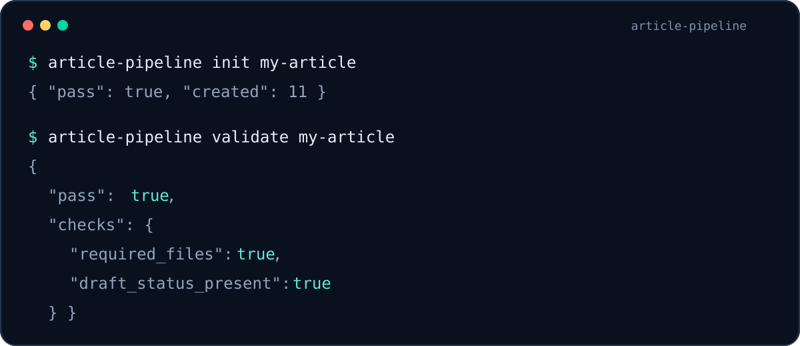
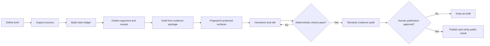

# Evidence-First Article Pipeline

[](https://github.com/dk3yyyy/evidence-first-article-pipeline/actions/workflows/ci.yml)
[](LICENSE)
[](https://www.python.org/)

An evidence-first production system for researching, writing, illustrating and validating technical articles with AI agents without surrendering citations, uncertainty or editorial control.

It is not an automatic truth machine or a one-click content generator. It combines a durable article-package format, explicit model handoffs and deterministic release gates so that human reviewers can see what is supported, what remains uncertain and what changed during editing.



## Why this exists

Most AI writing workflows save only the final prose. That discards the material needed to audit it: the brief, inspected sources, claim boundaries, unresolved questions, visual provenance and publication state.

This project keeps those artifacts together and adds mechanical checks for the evidence surfaces that editorial rewrites often damage:

- citation destinations and raw URLs;
- numbers, units and sample sizes;
- uncertainty language;
- code spans and fenced examples;
- headings and publication-status markers;
- visual paths and alt text;
- claim identifiers.

## Workflow



## Quick start

```bash
git clone https://github.com/dk3yyyy/evidence-first-article-pipeline.git
cd evidence-first-article-pipeline
python -m venv .venv
source .venv/bin/activate
python -m pip install -e .

article-pipeline init my-article
article-pipeline validate my-article
```

Complete the generated evidence package, then run the release gates:

```bash
# Record the evidence-sensitive surface before editorial rewriting.
article-pipeline fingerprint my-article/article.md \
  --json-out my-article/pre-edit-fingerprint.json

# Compare the edited candidate with the evidence-locked master.
article-pipeline compare my-article/article.md candidate.md \
  --json-out comparison.json

# Check citation and source URLs. Authentication blocks are reported separately.
article-pipeline audit-links candidate.md --json-out links.json

# Enforce house style without counting the required draft marker.
article-pipeline lint-dashes candidate.md --limit 0

# Count reader-facing prose after stripping metadata, URLs, images and code.
article-pipeline wordcount candidate.md --json-out wordcount.json

# Detect long sentences copied verbatim from the master edition.
article-pipeline distinctness my-article/article.md candidate.md

# Scan for unsupported experience claims with defaults or custom phrases.
article-pipeline check-fabrication candidate.md --term "our customers"

# Render sources.md and claim-ledger.md from the JSON authority files.
article-pipeline sync my-article

# Run the complete configured gate and save one durable report.
article-pipeline check my-article --master pre-edit-article.md \
  --json-out my-article/release-report.json

# Require completed placeholders and web exports for all three visual roles.
article-pipeline validate my-article --strict

# Build a deterministic ZIP only after strict validation passes.
article-pipeline package my-article --out dist/my-article.zip
```

Commands return nonzero exit codes when a gate fails, so they can be used in CI. All reports are JSON. See [Deterministic editorial gates](docs/editorial-gates.md) for normalization rules, defaults and limitations.

## Article-package contract

```text
my-article/
├── article-pipeline.toml
├── brief.md
├── sources.md
├── claim-ledger.md
├── outline.md
├── unresolved-questions.md
├── article.md
├── platform-notes.md
├── publication-checklist.md
├── review-summary.md
├── evidence/
│   ├── sources.json
│   ├── claims.json
│   └── model-provenance.json
├── schemas/
│   ├── sources.schema.json
│   ├── claims.schema.json
│   ├── visuals.schema.json
│   └── model-provenance.schema.json
└── visuals/
    ├── visual-plan.md
    ├── provenance.md
    ├── manifest.json
    ├── illustration-source.*
    ├── illustration-web.*
    ├── informative-image-source.*
    ├── informative-image-web.*
    ├── diagram-source.*
    └── diagram-web.*
```

The JSON evidence files are authoritative. `article-pipeline sync` renders the human-readable Markdown tables from them. Verified claims are connected to article paragraphs with markers such as `<!-- claims: CLM-001 -->`, allowing required qualifiers to be checked within the claim that needs them rather than counted globally.

Project policy lives in `article-pipeline.toml`: word limits, em-dash policy, fabrication phrases, link behavior and required visual roles. See the [machine-readable package format](docs/package-format.md) and the [complete passing example](examples/minimal-article/).

## Agent and model contract

The pipeline is model-neutral. A recommended separation is:

1. **Research and audit role:** source inspection, contradictions, claim ledger and final evidence review.
2. **Writing and editorial role:** structure, explanation, pacing and line editing from the approved package.
3. **Human owner:** consequential editorial decisions and publication authorization.

A prompt name does not switch models. Record the actual provider and model used when reproducibility matters. Never let the writing role invent a new source, quotation, statistic, experiment or event. New factual material returns to research.

See [Model handoff](docs/model-handoff.md).

## Visual storytelling

A complete package plans visuals during outlining rather than decorating the finished draft. The default contract calls for:

- an original editorial illustration;
- an informative visual such as a chart, timeline or annotated comparison;
- an explanatory diagram showing a process, system or relationship.

Every asset should include editable source, web export, placement, caption, alt text and provenance. See [Visual storytelling](docs/visual-storytelling.md).

## What the validator does not prove

A passing comparison means protected tokens and structures survived. It does **not** prove that:

- a source supports the surrounding sentence;
- a paraphrase preserved causal meaning;
- the research is complete;
- the article is fair or interesting;
- a visual is readable or non-misleading;
- publication complies with the destination's current rules.

Those remain semantic and human review responsibilities. The tool fails closed where deterministic comparison is useful and refuses to pretend regexes can perform scholarship.

## Development

```bash
python -m unittest discover -s tests -v
ruff check article_pipeline tests
mypy article_pipeline
coverage run -m unittest discover -s tests
coverage report
python -m compileall -q article_pipeline tests
python -m pip install -e '.[dev]'
article-pipeline --version
```

See [CONTRIBUTING.md](CONTRIBUTING.md) for change requirements.

## Security and privacy

The CLI uses the Python standard library and sends no article content to an AI provider. `audit-links` makes HTTP requests only to URLs already present in the selected article. Agent or model privacy depends on the model environment you choose.

Never commit credentials, confidential drafts or licensed source material without authorization. See [SECURITY.md](SECURITY.md).

## Status

Version 0.3 is an alpha release. It adds machine-readable evidence manifests, claim-local qualifier checks, robust Markdown destination scanning, one aggregate release command and reproducible archives with internal file hashes. Platform-specific browser publishing remains intentionally outside the core CLI because editor behavior and disclosure rules change frequently.

## License

Apache License 2.0. See [LICENSE](LICENSE).
