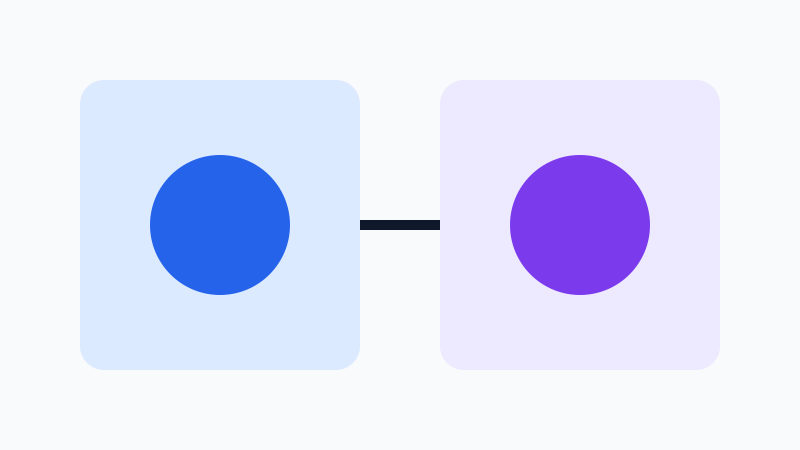

# A Small Evidence-First Article

A minimal fixture for the repository's validation and packaging commands.

## Keep the evidence beside the prose

<!-- claims: CLM-001 -->
The project stores a publication brief, inspected sources, claim records, visual provenance and release checks beside the article draft.

## Mechanical checks are useful, but bounded

<!-- claims: CLM-002 -->
The command-line tool can run deterministic local checks without making a model-provider request.

A passing report cannot prove that a source supports a sentence. Human evidence review remains part of the release boundary.

**DRAFT — NOT PUBLISHED**
